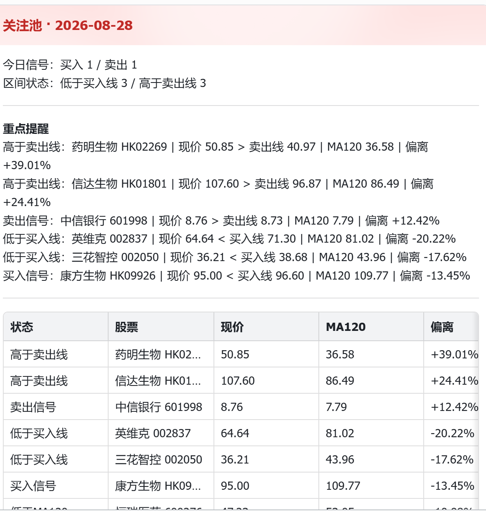

# ma120-monitor

基于 **MA120 均线** 的持仓 & 关注池监控脚本，每日通过飞书推送买入/卖出信号；另提供 ETF 均线、估值和涨跌幅三种定投计划。

## 效果示例

飞书卡片推送效果示例：



## 策略

- **MA120：** 最近 120 个交易日收盘价的算术平均值，即 `sum(最近 120 个交易日收盘价) / 120`；不足 120 根日 K 的股票会跳过。
- **偏离率：** `(现价 - MA120) / MA120 × 100%`，**基准是 MA120**，展示为「偏离MA120」列。
- **买入线：** `MA120 × 0.88`，即低于 MA120 约 12%。
- **卖出线：** `MA120 × 1.12`，即高于 MA120 约 12%。
- **距买入线：** `(现价 - 买入线) / 买入线 × 100%`，**基准是买入线**，展示为「距买入线」列。

> **两个偏离口径别看混了。** 买入线本身就是 `MA120 × 0.88` 派生出来的，所以现价在买入线下方时，它到 MA120 的距离**必然**比到买入线的距离大得多 —— 差的那部分正是 MA120×12% 的带宽。
> 例：现价 66.23、MA120 79.92、买入线 70.33 → 偏离MA120 **-17.12%**（差 13.69 元），距买入线 **-5.83%**（差 4.10 元）。两个都对，只是基准不同。

### 行情口径

- **A 股：** 新浪财经日 K 和实时盘口行情。
- **港股：** 腾讯前复权日 K 和实时盘口行情，股票代码使用 `HK` 加 5 位数字，例如 `HK01801`。
- **现价：** 使用实时盘口最新成交价，用于计算当前偏离率和判断信号。
- **MA120：** 只根据日 K 收盘价序列计算，实时价不会直接替换均线序列中的收盘价。
- **缓存：** 日 K 本地 JSON 缓存在 `.stock_cache/`，同一自然日内复用，跨日自动刷新；实时盘口不走本地缓存。
- **回退：** 实时盘口请求失败时，现价会回退到日 K 最新收盘价，保证脚本不中断。
- **交易日判断：** 带上 `--skip-non-trading-day` 时，会先用几支大盘股（600015/601318/000651）探测当日实时行情；取不到就判定为非交易日并跳过推送，避免法定节假日调休时空推卡片。该判断**只在 09:30 之后可靠**——开盘前取不到实时价，无法区分「还没开盘」和「非交易日」。

### 信号判定

- **买入信号：** 当前价跌破当前买入线，并且上一交易日收盘价仍在上一交易日买入线之上或等于买入线。
- **卖出信号：** 当前价突破当前卖出线，并且上一交易日收盘价仍在上一交易日卖出线之下或等于卖出线。
- **区间状态：** 如果股票已经连续处于阈值之外，不会每天重复生成新的买入或卖出信号，而是显示为“低于买入线”或“高于卖出线”。

因此，“今日买入/卖出信号”表示当天首次穿越阈值；“低于买入线/高于卖出线”表示当前所处区间，两者含义不同。

## 文件结构

```
ma120-monitor/
├── stock_dynamic_monitor.py     # 主脚本（持仓 + 关注池，飞书推送）
├── stock_monitor.py             # 旧版（保留备查）
├── stock_portfolio_monitor.py   # 旧版（保留备查）
├── backtest_ma120_strategy.py   # MA120 策略回测工具
├── stocks.xlsx                  # 数据源（sheet: portfolio / watchlist）
├── pyproject.toml               # 项目元数据与依赖清单
├── uv.lock                      # 依赖锁定文件
├── conftest.py                  # pytest 路径配置
├── tests/                       # 单元测试（飞书卡片 / 行情数据）
├── .env.example                 # 飞书 webhook 配置模板
├── .github/workflows/           # GitHub Actions 定时任务
├── doc/images/                  # README 示例图片
├── LICENSE                      # MIT
└── .stock_cache/                # 日 K 行情缓存（当天有效，一只一个 JSON）
```

## 用法

### 安装 uv

本项目使用 `uv` 管理 Python、虚拟环境和依赖。首次使用先安装 `uv`：

```powershell
# Windows（推荐）
winget install --id=astral-sh.uv -e
```

macOS / Linux：

```bash
curl -LsSf https://astral.sh/uv/install.sh | sh
```

安装后运行 `uv --version` 确认命令可用。项目通过 `pyproject.toml` 声明依赖，并用 `uv.lock` 锁定版本；首次执行 `uv run` 时会自动准备 Python 3.12 和项目环境。

### 首次配置

项目提供了 `.env.example` 模板。先复制一份为 `.env.local`：

```powershell
Copy-Item .env.example .env.local
```

然后编辑 `.env.local`，把占位 token 替换成飞书群机器人 webhook：

```env
FEISHU_WEBHOOK_URL=https://open.feishu.cn/open-apis/bot/v2/hook/你的-webhook-token
```

`.env.local` 已被 `.gitignore` 忽略，不要提交真实 webhook。

### Windows PowerShell

```powershell
cd D:\Project\github\ma120-monitor
$env:PYTHONUTF8='1'
$env:UV_CACHE_DIR='D:\Project\github\ma120-monitor\.uv-cache'

# 持仓 + 关注池（默认推送飞书卡片）
uv run python stock_dynamic_monitor.py

# 只看终端，不发飞书
uv run python stock_dynamic_monitor.py --no-feishu

# 非 A 股交易日直接跳过，不推卡片（定时任务的推荐用法）
uv run python stock_dynamic_monitor.py --skip-non-trading-day

# 只看持仓
uv run python stock_dynamic_monitor.py --portfolio --no-feishu

# 只看关注池
uv run python stock_dynamic_monitor.py --watchlist --no-feishu

# 运行测试
uv run python -m unittest discover -s tests

# 运行近 5 年历史回测
uv run --extra backtest python backtest_ma120_strategy.py
```

### macOS / Linux

```bash
cd /path/to/ma120-monitor
export PYTHONUTF8=1
export UV_CACHE_DIR="$PWD/.uv-cache"

# 持仓 + 关注池（默认推送飞书卡片）
uv run python stock_dynamic_monitor.py

# 只看终端，不发飞书
uv run python stock_dynamic_monitor.py --no-feishu
```

## 配置

编辑 `stocks.xlsx`，包含两个 sheet：

**sheet `portfolio`** — 持仓清单：

| 股票代码 | 股票名称 | 成本价 | 持仓数量 |
|---|---|---|---|
| 600015 | 华夏银行 | 0 | 0 |
| 601899 | 紫金矿业 | 0 | 0 |

> 成本价/数量留空或 0 表示不计算浮盈，只看信号。
> 股票代码可写成文本或数字，脚本会自动补齐 6 位。

**sheet `watchlist`** — 关注池：

| 股票代码 | 股票名称 |
|---|---|
| 601998 | 中信银行 |
| 600989 | 宝丰能源 |

表头支持中文（`股票代码/股票名称/成本价/持仓数量`）或英文（`code/name/cost/shares`）。

港股代码请使用 `HK` 加 5 位数字，例如信达生物写作 `HK01801`，以保留前导零并自动切换港股行情源。

**依赖：** `uv run` 会根据 `pyproject.toml` 和 `uv.lock` 自动准备固定版本的 Python 与项目依赖，无需手动执行 `pip install`。回测依赖按需通过 `--extra backtest` 安装，旧版脚本依赖按需通过 `--extra legacy` 安装，不影响主监控的首次启动速度。

**飞书推送配置优先级：**

1. 环境变量 `FEISHU_WEBHOOK_URL`
2. 项目根目录 `.env.local` 中的 `FEISHU_WEBHOOK_URL`
3. 都没配置时，脚本会跳过飞书推送并在终端提示

## ETF 定投

股票 MA120 和 ETF 定投是两个独立入口。ETF 模块只生成计划、保存结果和登记你已经成交的交易，**不连接券商、不自动下单**。ETF 清单不放在 `stocks.xlsx`，避免与股票信号混在一起。

### 启动与清单

首次在项目目录执行（已有本地配置时不要覆盖）：

```powershell
Copy-Item etf_plans.example.toml etf_plans.toml

# 只看四只 ETF 的生效策略，不推送
uv run python etf_dca.py

# 同时比较三种策略，共 12 行，不推送
uv run python etf_dca.py --compare

# 用同一个 .env.local webhook 推送 ETF 原生表格卡片
uv run python etf_dca.py --compare --feishu

# 也可从原主脚本进入；该入口延续默认推送的习惯
uv run python stock_dynamic_monitor.py --etf --compare --no-feishu
```

macOS/Linux 首次使用 `cp etf_plans.example.toml etf_plans.toml`。其他命令一致。

编辑 `etf_plans.toml`，模板已提供以下四只境内上市 ETF，单位均为人民币：

| 计划 ID | ETF | 代码 | 跟踪指数标识 |
| --- | --- | --- | --- |
| csi300 | 华泰柏瑞沪深300ETF | 510300 | 000300 |
| csi1000 | 南方中证1000ETF | 512100 | 000852 |
| sp500 | 博时标普500ETF | 513500 | SPX |
| nasdaq100 | 国泰纳斯达克100ETF | 513100 | NDX |

标识 `SPX`、`NDX` 用于本项目估值文件匹配，不是境内 ETF 的交易代码。产品信息可查[南方基金](https://www.nffund.com/main/files/2024/10/25/381785095382.pdf)、[博时基金](https://www.bosera.com/column/index.do?classid=0002000200030004&fundCode=513500)、[国泰基金](https://www.gtfund.com/product/productlist/haiwai/513100/index.html)。

模板默认每只 `base_amount = 1000`、单期 `max_amount = 2000`，每周一、MA500，**只是可修改的演示参数，不是视频回测的最优参数**。每只 ETF 的 `strategy` 只能选择一种：

- `ma`：均线定投。
- `valuation`：指数估值定投。
- `drawdown`：相对实际持仓成本的涨跌幅定投，**不是相对历史最高价的回撤**。

`--compare` 中其余两种策略只显示参考预算，本期预算为 0，不会重复加总。`cost` 和 `shares` 是使用账本前的初始持仓；默认均为 0，表示无持仓。

### 三种计算规则

均线定投的均线周期由 `[settings].ma_days` 配置，支持 120、180、250、500 等，当前上限 600。公式为 `最近 N 个已完成交易日的前复权收盘价之和 / N`，**始终排除运行当天的日 K**，避免盘中未收盘的 K 线改变均线。偏离为 `(实时价 / 均线 - 1) * 100%`。

涨跌幅定投使用 `(实时价 / 持仓平均成本 - 1) * 100%`。尚无持仓时，首期按基础金额；有持仓时必须有有效成本。买入成交金额和佣金计入平均成本，卖出按比例减少持仓成本总额。

这两种策略默认共用以下阶梯，均可在 `bands` 和 `above_multiplier` 中修改。`below` 是**严格小于**的上界：

| 相对均线或成本的偏离 | 基础金额乘数 |
| --- | --- |
| 小于 -20% | 2.0 |
| -20% 至小于 -10% | 1.5 |
| -10% 至小于 0% | 1.2 |
| 0% 至小于 10% | 1.0 |
| 10% 至小于 20% | 0.8 |
| 大于等于 20% | 0.5 |

预算为 `min(基础金额 * 乘数, 单期上限)`。按行情价格向下取 100 份的整手，显示本期预算、份额和整手估算金额；估算不含佣金，未用满的预算不会自动滚入下一期。

估值定投看的是**跟踪指数的 PE-TTM 历史分位**，不拿 ETF 价格、均线或基金净值充当估值：

- 小于 30% 分位：按基础金额定投，仍受单期上限约束。
- 30% 至小于 70% 分位：暂停新增投入。
- 大于等于 70% 分位：暂停并标注“高估，减仓观察”。本版不自动生成分批卖出数量。

分位采用中间秩：`(小于当前 PE 的样本数 + 等于当前 PE 的样本数 / 2) / 样本总数 * 100%`。连续相同 PE 的历史是 50% 分位，不会被当成 100%。30% 分位并不是 PE 小于 30 倍。

### 估值数据导入

**当前版本尚未对接自动指数 PE 数据源**，需从你可用的数据平台导出相同计算口径的指数 PE-TTM 历史 CSV。模板 `etf_valuation.example.csv` 只含表头，未编造历史数据。对应文件路径在每只计划的 `valuation_csv` 中设置：

```text
etf_valuations/000300.csv
etf_valuations/000852.csv
etf_valuations/SPX.csv
etf_valuations/NDX.csv
```

每份 CSV 必须包含：

| 列 | 含义 |
| --- | --- |
| date | 估值所属日期，YYYY-MM-DD |
| available_date | 该数据实际可获得的日期，YYYY-MM-DD，不得早于 date |
| index_code | 与计划一致的指数标识；000300/000852 要保留前导零 |
| pe_ttm | 正数、有限值，统一 PE-TTM 计算口径 |

默认取截至运行前一天的近 10 年数据，至少 2000 个观测、跨度至少 3285 天，最新估值距离该截止日不超过 7 个自然日。配置项分别为 `lookback_years/min_samples/min_span_days/max_age_days`。日级公布日期无法表达盘中何时可用，因此保守地排除运行当天发布的估值，忽略未来或尚未公布的记录。重复日期、非正 PE、缺失、过期或样本不足会显示“数据待补”，该策略的本期预算为 0。不能把一年数据算出的分位标成十年分位。跨境指数的 `available_date` 请按北京时间可获得信息的日期填写。

### 行情、周期与结果

- ETF 日 K 使用腾讯前复权和未复权序列，以最新共同日的开盘价比例将复权序列换算到当前价格尺度，再与腾讯实时价比较。使用盘中固定的开盘价，避免两次接口请求的当日收盘价不同而导致均线漂移。复权序列缺失时不会悄悄用未复权替代。
- ETF 均线基于**境内 ETF 的人民币场内价格**。标普/纳斯达克 ETF 的价格还受汇率和折溢价影响，不等于美国指数本身的均线；本版尚未加入 IOPV/溢价过滤。
- `.stock_cache/etf/日期/` 保存完整行情快照，同日最多复用 5 分钟；不会删除旧快照。取长均线时不会复用短历史缓存。网络失败会明确显示数据错误。
- `frequency` 支持 `daily`、`weekly`、`monthly`；周计划 `weekday=0..4` 表示周一至周五，月计划 `monthday=1..28`。计划日非交易日时，同周/同月内顺延到有当日交易行情的运行日；不会补买更早周期遗漏的预算。运行脚本本身不会安装定时任务。
- 使用当日有效、有成交量的行情判断可生成计划，盘中还检查行情是否在 10 分钟内。休市、停牌或旧行情只展示参考，不产生本期买入预算。收盘后可用当日收盘盘口生成建议。
- 每次运行保存独立的 `dca_results/时间_运行ID.json` 和 `.txt`，并保存到 `journal.sqlite3` 的 reports 表。JSON 包含配置快照、行情时间、均线日期、估值样本区间、预算和原因。此处是运行建议的留档，**不是收益回测结果**。
- 运行预览或推送不代表成交；只在登记真实买入后才将该周期标为“本期已买入”。本地配置、估值 CSV、账本和结果都已加入 `.gitignore`，不要删除账本，否则会失去成本和防重复记录。
- 若生效策略缺数据，进程退出码为 2；配置、网络推送等运行错误为 1；正常预览为 0。对比策略缺失不会阻止其他生效策略。

### 成交登记

实际在券商成交后，用唯一成交编号登记，下面的价格、份额和日期都需要替换为你的真实成交：

```powershell
uv run python etf_dca.py --record-trade csi300 --side buy --shares 200 --price 4.20 --fee 5 --trade-date 2026-09-07 --fill-id broker-20260907-001

# 卖出同样登记，自动更新剩余份额；不能卖超已有持仓
uv run python etf_dca.py --record-trade csi300 --side sell --shares 100 --price 4.30 --fee 5 --trade-date 2026-09-08 --fill-id broker-20260908-001
```

登记命令不会请求行情、发送交易或推送飞书。相同 `fill-id` 不允许重复登记；同一计划按成交日期顺序录入。已有账本后，不要把登记过的交易再加进配置的初始 `cost/shares`，也不要把原计划 ID 改成另一只 ETF。分红、份额拆分和券商持仓自动同步尚未实现，发生这些情况后需先核对成本与份额。

## 定时运行

仓库已内置 GitHub Actions workflow：`.github/workflows/ma120-monitor.yml`，每周一至周五 **UTC 04:00**（北京时间 12:00，A 股与港股午间休市）自动执行，无需本机常开。

启用步骤：

1. 进入仓库 **Settings → Secrets and variables → Actions → New repository secret**
2. 名称填 `FEISHU_WEBHOOK_URL`，值填你的飞书群机器人 webhook
3. 打开 **Actions** 页签，选择 `MA120 Monitor` → **Run workflow** 手动触发一次验证

> 说明：
>
> - GitHub 的定时任务只支持 UTC，且**不保证准点** —— 实测曾延迟约 4 小时。未配置 secret 时脚本不会报错，只会在日志里提示跳过飞书推送。
> - 定时设在午间休市，取到的是**上午收盘价**，因此信号为盘中口径，与收盘后跑的结果可能不同。

定时规则的 `1-5` 只能表达「周一至周五」，遇法定节假日仍会触发。当前 workflow 未开启交易日过滤；需要时可在运行命令末尾添加 `--skip-non-trading-day`，脚本会在探测不到当日行情时跳过监控和推送。

## 免责声明

本项目仅供学习与研究使用，不构成任何投资建议。股市有风险，投资需谨慎；据此操作，风险自担。行情数据来自第三方公开接口，不保证其准确性与实时性。

## License

[MIT](LICENSE)
